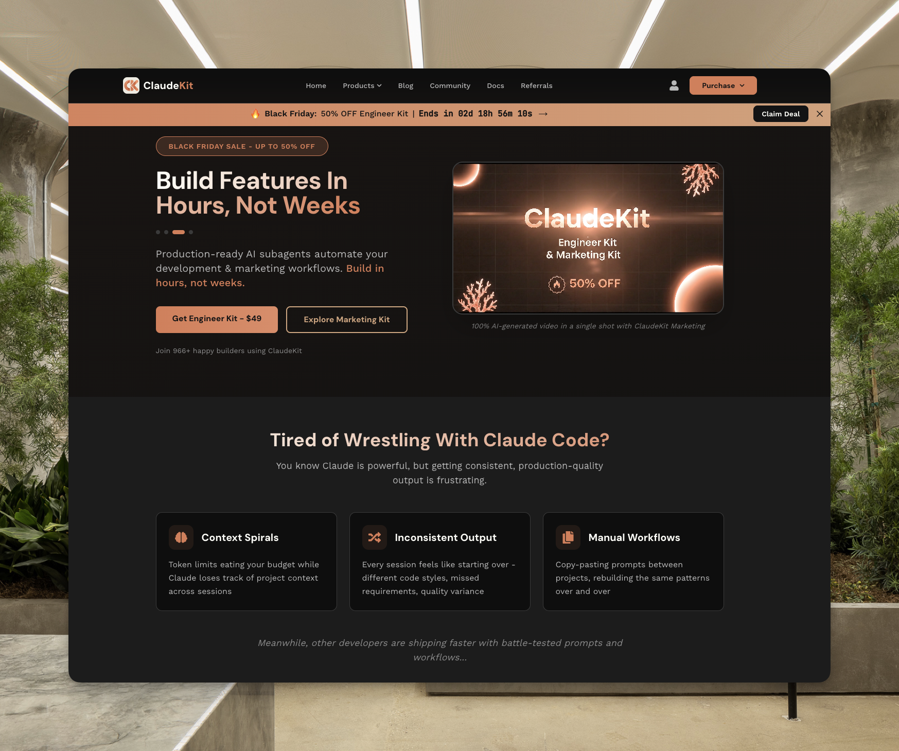

# ClaudeKit



> 🌐 Visit [claudekit.cc](https://claudekit.cc)

**Premium Claude Code Starter Kits for Solo Developers & Indie Makers**

Build faster with AI-powered development workflows. ClaudeKit provides production-ready boilerplates, 50+ slash commands, multi-agent orchestration, and comprehensive automation tools designed specifically for Claude Code.

## Products

### Engineer Kit - $99

Comprehensive Claude Code boilerplate with AI agent orchestration for developers.

**Features:**
- 50+ slash commands for development workflows
- Multi-agent orchestration system
- Automated testing and code review
- Documentation management
- Git workflow automation
- 20+ skills library

**Best for:** Solo developers, startups, tech leads

### Marketing Kit - $99 (Coming Soon Q1 2026)

Research, sales, and marketing automation with Claude Code.

**Features:**
- Market research automation
- Content generation workflows
- SEO optimization tools
- Social media management
- Analytics and reporting

**Best for:** Indie makers, marketers, growth teams

### Combo Bundle - $149 (Coming Soon Q1 2026)

Both Engineer and Marketing Kits at a $49 discount.

## Quick Start

```bash
# Install ClaudeKit CLI
npm install -g claudekit-cli

# Initialize a new project
claudekit init my-project

# Or add to existing project
claudekit add
```

## Repositories

| Repository | Description | Access |
|------------|-------------|--------|
| [claudekit-engineer](https://github.com/claudekit/claudekit-engineer) | Engineer Kit - AI agent orchestration & dev workflows | Private (Purchase required) |
| [claudekit-marketing](https://github.com/claudekit/claudekit-marketing) | Marketing Kit - Research & marketing automation | Private (Coming soon Q1 2026) |
| [claudekit-cli](https://github.com/mrgoonie/claudekit-cli) | CLI tool for quick project setup | Public |
| [claudekit-docs](https://github.com/claudekit/claudekit-docs) | Public documentation | Public |

## How It Works

1. **Purchase** - Visit [claudekit.cc](https://claudekit.cc) and choose your kit
2. **Pay** - Credit card (global) or bank transfer (Vietnam via VietQR)
3. **Access** - Receive GitHub repository invitation within minutes
4. **Build** - Start developing with AI-powered workflows

## Payment Options

- **Global**: Credit/debit cards via Polar.sh (USD)
- **Vietnam**: Bank transfer via SePay/VietQR (VND)

## Support

- **Website**: [claudekit.cc](https://claudekit.cc)
- **Documentation**: [docs.claudekit.cc](https://docs.claudekit.cc)
- **Discord**: [Join Community](https://discord.gg/x7SwTSf3wc)
- **Email**: support@claudekit.cc
- **X (Twitter)**: [@goon_nguyen](https://x.com/goon_nguyen)

## Guarantee

30-day money-back guarantee on all purchases. Not satisfied? Request a refund through your customer dashboard.

---

Built for developers who ship fast.
